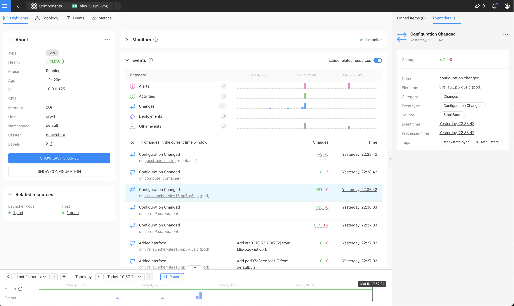

# SUSE Observability Extension for SUSE Virtualization

[SUSE Observability](https://www.suse.com/solutions/observability/) is full-stack observability platform with tons of 
extension and integration possibilities.

This repository contains the extension to support [SUSE Virtualization](https://www.suse.com/products/rancher/virtualization/).

SUSE Virtualization delivers an open-source, cloud native virtualization platform for a cloud-native and hybrid 
cloud world combining all the elements of a traditional data center with modern cloud-native AI, edge and multi-cloud
infrastructure environments.

## SUSE Observability Agent 

Out of the box SUSE Observability's agent can observe **SUSE Virtualization** clusters.

## Extension Design

The extension reads the `VirtualMachineInstances` CRDs and converts them into `Virtual Machine` components in SUSE Observability.

### SUSE Virtualization Menu


### Virtual Machines Overview Pages


### Virtual Machines Highlight Page


### Virtual Machines Changes




### Virtual Machines Topology


See [Setup Guide](./setup/README.MD) for a comprehensive example of setting up an environment and deploying
the extension.

## Helm Deployment

Setup a basic `values.yaml` containing connectivity information about your SUSE Observability instance.

```yaml
serverUrl:  https://xxxx.     # Suse Observability Url
apiKey: xxx                   # Suse Observability Api Key
apiToken: xxx                 # Suse Observability CLI api token.
clusterName: lab             # Instance name as defined for the AutoSync StackPack instance in Suse Observability
```

Then run the following Helm commands,

```bash
helm repo add so-ext https://ravan.github.io/helm-charts
helm upgrade --install --namespace suse-observability-extensions --create-namespace -f values.yaml so-virt suse-observability-addons/so-virt                           

```

## Configuration

### Environment variables

Environment variables can be used to set up the extension.

| Variable                      | Required | Default        | Description                                         |
|-------------------------------|----------|----------------|-----------------------------------------------------|
| SUSEOBSERVABILITY_API_URL     | yes      |                | The url to the SUSE Observability server            |
| SUSEOBSERVABILITY_API_KEY     | yes      |                | The api key used by the SUSE Observability server   |
| SUSEOBSERVABILITY_API_TOKEN   | yes      |                | The cli token used to access SUSE Observability API |
| KUBERNETES_KUBECONFIG         | no       | ~/.kube/config | KubeConfig file to use to connect to K8s            |
| KUBERNETES_IN_CLUSTER         | no       | false          | Use in cluster K8s connection                       |
| KUBERNETES_CLUSTER            | yes      |                | Kubernetes Cluster name as defined in StackState    |
| INSTANCE_TYPE                 | no       | virt           | The Custom Syn StackPack instance type.             |
| INSTANCE_URL                  | yes      |                | The Custom Syn StackPack instance url               |


### Config File

Configuration could also be in a yaml file.
The location of the config file can be set in the `CONFIG_FILE`environment variable

```yaml
suseobservability:
  api_url: "https://xxx.stackstate.io"
  api_key: "5385xxxx"
  api_token: "5xxxx"
  
kubernetes:
  cluster: retailstore
  in_cluster: false
  kubeconfig: ./kubeconfig
  
instance:
  type: virt
  url: retailstore

```


## Development

### Prerequisites

- [Taskfile](https://taskfile.dev/installation/)


### Run

Setup the `conf.yaml' file with your environment details.

```bash
cp conf.yaml.example conf.yaml
task run
```

### Build

Add the Docker login info to your `.env` file.

```
USER="<my dockerhub user name>"
PWD="<my dockerhub password>"
```

To build and push the container, 

```shell
task docker-build
task docker-push
```

