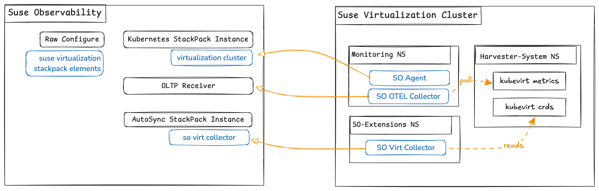

# Setup Guide

This guide contains instructions on how to setup the SUSE Virtualization extension for SUSE Observability.




## Prerequisites

Ensure you have the following tools installed and properly configured:

- **[SUSE Observability CLI](https://docs.stackstate.com/cli/cli-sts)** – Command-line interface for SUSE Observability.
- **[Taskfile](https://taskfile.dev/installation/)** – A task runner for automating commands.
    - Supports tab completion, making it easy to view available tasks.
- **[Gomplate](https://docs.gomplate.ca/installing/)** – A powerful template processor.
- **[Lima](https://lima-vm.io/docs/installation/)** - Launches Linux virtual machines locally.
- **[Helm](https://helm.sh/docs/intro/install/)** – A package manager for Kubernetes.

Check out this repository and execute all commands from its root.

```bash
git clone https://github.com/ravan/so-virt.git
cd so-virt
```

Setup your `.env` with correct values for

```
# The working directory to resolve the KUBECONFIG_FILE_NAME
KUBECONFIG_FILE_PATH=/Users/rnaidoo/sts/repos/github/ravan/so-virt

# --- OBSERVED CLUSTER  --- #

# SUSE Virtualization Cluster's kubeconfig file
KUBECONFIG_FILE_NAME=kubeconfig

# --- TARGET SUSE OBSERVABILITY BACKEND --- #

# Name of the instance as defined in SUSE Observability K8s StackPack Instance
CLUSTER_NAME=retail-store

# The url to your SUSE Observanility instance
SO_URL=https://xxx.io

# The Open Telemetry Protocol host name
SO_OTLP=otlp-xxx.io

# Your SUSE Observability API_KEY
SO_API_KEY=181335cxxxxxx

# Your SUSE Observability CLI Token.
SO_TOKEN=tRa6xxxxx

# --- HELM Repo --

# helm repo add suse-observability-addons https://ravan.github.io/helm-charts/
HELM_REPO=suse-observability-addons
```

Now change directory to the `setup` directory to continue setting up the various components.

```bash
cd setup
```

## Setup SUSE Observability

Before installing any agents in the cluster, we need to prepare the SUSE Observability
instance.

### StackPack Instances

Create stackpack instances on SUSE Observability to prepare topology ingestion pipelines
to receive data from the native, virtual and shared clusters

#### Kubernetes StackPack Instance

Create an instance to receive data from the downstream observed cluster.

```bash
task so-create-k8s-stackpack-instance
```

#### AutoSync StackPack Instance

You most probably do not have the AutoSync StackPack installed by default.
Upload the stackpack using,

```bash
task dev:upload-autosync-stackpack-instance
```

Next create an instance to receive data from our K3K extension.

```bash
task so-create-virt-autosync-stackpack-instance
```


## Setup Observed Clusters

### SUSE Observability Agent

Lets deploy the agent to the SUSE Virtualization cluster. 

```bash
task native-deploy-observability-agent
```

Check SUSE Observability user interface to make sure data from this cluster has been ingested.

### SUSE Observability Open Telemetry Collector

Next deploy the Open Telemetry collector configured for SUSE Observability and KubeVirt metrics

```bash
task native-deploy-otel-collector
```

### SUSE Virtualization Extension

#### Stackpack Elements

We have custom menus, highlight pages, metrics, overview pages, monitors, etc.
that we need to upload to the SUSE Observability instance.

```bash
task so-install-virt-stackpack-elements
```

#### Deploy Virtualization Extension

The virtualization extension analyses the KubeVirt `VirtualMachineInstance` CRDs and creates topology data in SUSE Observability. 

```bash
task native-deploy-so-virt
```

The cron job will run every 5 minutes to sync K3K model with SUSE Observability.
If you wish to manually trigger the job run,

```bash
task native-trigger-so-virt-job
```


